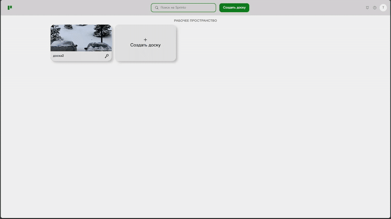
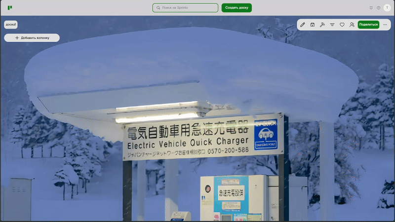
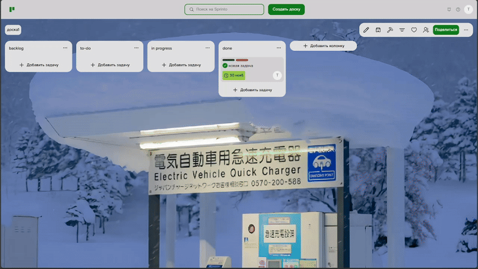

# 🌪️ Sprinto — Kanban-менеджер задач (аналог Trello)


Sprinto — это удобное, лёгкое и современное приложение для управления задачами в формате канбан-досок.  
Создано для того, чтобы упростить вам жизнь: от распределения задач и организации рабочего процесса — до совместной работы и наглядного контроля прогресса.  
Минимум лишнего, максимум удобства. Всё работает быстро, плавно и интуитивно.

---

## 🚀 Основные возможности

### 🔐 Авторизация и регистрация
- Поддержка JWT + Refresh токена  
- Токены автоматически обновляются  
- Сессия сохраняется между перезагрузками  
- Возможность выйти из аккаунта (Log Out)


---

### 🏁 Доски (Boards)
- Создание новых досок  
- Полный CRUD  
- Доски автоматически сортируются по последнему изменению  



---

### 🧱 Столбцы (Columns)
- Создание, редактирование и удаление  
- Полный CRUD  
- Возможность архивировать все задачи в колонке одной кнопкой  



---

### 📝 Задачи (Tasks)
- Полный CRUD  
- Drag & Drop перетаскивание между столбцами  
- Добавление срока выполнения (дата + время)  
- Назначение исполнителя задачи  
- Архивация, восстановление и полное удаление  


---

### 🏁 Теги (Tags)
- Создание кастомных тегов  
- Редактирование и удаление  
- Добавление тегов к задачам  

---

### 👤 Профиль пользователя
- Изменение аватарки  
- Изменение логина и почты  
- Настройки профиля



---

### ✨ UI и анимации
- Плавные hover-эффекты  
- Анимации SVG-иконок  
- Анимированные dropdown-меню  
- Плавные переходы и микроанимации

---

# 🛠 Используемый стек

### **Frontend**
- Vite + React + TypeScript  
- SCSS  
- Custom hooks  
- Form handling  
- Анимации и модульные компоненты

### **Backend**
- Node.js + Express.js  
- PostgreSQL + Sequelize  
- JWT (access + refresh)  
- Bcrypt  
- Formidable (загрузка изображений)  
- Middleware + защищённые эндпоинты

---
# Установка зависимостей

1. Клонирование проекта
```
https://github.com/bakko7821/sprinto-kanban-app
```
2. Запуск фронта
```
cd client
npm install
npm run dev
```
3. Запуск клиента
```
cd server
npm install
npm run dev
```
